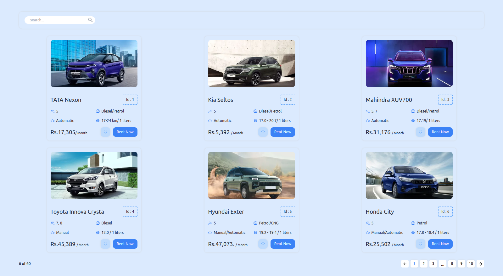

# Pagination App

## Overview

Pagination App is a web application built using React, Vite, and Tailwind CSS. It provides a user-friendly interface for navigating through a list of items, allowing users to explore data with ease. The app utilizes the React-pagination library for efficient pagination and stores data in a `data.js` file.

## Features

- Seamlessly paginate through a large dataset.
- Modern and responsive user interface powered by Tailwind CSS.
- Utilizes the React-pagination library for easy navigation.
- Data is managed through a `data.js` file, making it easy to update.

## Technologies Used

- React: A JavaScript library for building user interfaces.
- Vite: A fast development build tool for web projects.
- Tailwind CSS: A utility-first CSS framework for stylish designs.
- React-pagination: A pagination library for React applications.

## Hosted Version

You can access the hosted version of the Peregrination app at the following URL:

[https://react-pagination-app-harshbhange0.netlify.app/](https://react-pagination-app-harshbhange0.netlify.app/)

## Getting Started

To get started with the Peregrination app, follow these steps:

1. Clone this repository to your local machine:

2. Navigate to the project directory:

3. Install dependencies:

4. Start the development server:

5. Open your browser and go to [http://localhost:5173](http://localhost:5173/) to view the app.

## Data Management

The app uses a `data.js` file to store destination information, including images, descriptions, and other details. You can modify this file to add or update destinations as needed.

## Contributing

If you'd like to contribute to the Peregrination app, please follow these guidelines:

1. Fork the repository.
2. Create a new branch for your feature or bug fix.
3. Make your changes and test them thoroughly.
4. Submit a pull request with a clear description of your changes.

## License

This project is licensed under the MIT License - see the [LICENSE](LICENSE) file for details.

## Acknowledgments

- React-pagination library: [Link to library](https://github.com/AdeleD/react-paginate)
- Tailwind CSS: [Official Documentation](https://tailwindcss.com/docs)
- Vite: [Official Documentation](https://vitejs.dev/)
